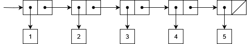

# Lists
A list is a sequence of zero or more values that can be of different types.
In order to create one, we can use pairs in a very specific way.

A list starts with a pair whose first element is the first value of the list and its second element
is the next pair which repeats this pattern. The second element of the last pair is [nil](../primitives/nil.md),
a special primitive value that terminates a list, which is also known as the empty list.

Let's see an example.

```scheme
(cons 1 (cons 2 (cons 3 (cons 4 (cons 5 nil)))))
```
-> *(1 2 3 4 5)*

As you can see, a list's string representation is its elements one after the other and all
surrounded with parentheses.

There is a primitive procedure called [list](../primitives/list.md), that makes it easier for us to create one.
Let's see the equivalent `list` expression.

```scheme
(list 1 2 3 4 5)
```
-> *(1 2 3 4 5)*

The above list's memory representation looks like the following diagram.



An interesting aspect of the list's structure, is what we get if we apply `cdr` to it. Can you guess?

```scheme
(cdr (list 1 2 3 4 5))
```
-> *(2 3 4 5)*

We get the rest of the list which is still a list! This is because of the repetitive nature of the list's
internal structure that we investigated above.

As mentioned before, `nil` is the empty list.

```scheme
nil
```
-> *()*

It is equivalent to the following expression.

```scheme
(list)
```
-> *()*

Another common way to declare an empty list, is to use the alternative quote notation like this.

```scheme
'()
```
-> *()*

> A very useful primitive procedure is called [null?](../primitives/is-null.md). It helps us determine if a list is empty or not.
Of course, one could use the `=` and `nil` primitives like so `(= '() nil)`, or simply use the
`null?` procedure like so `(null? '())`.

```scheme
(null? '())
```
-> *true*

Let's put all this together, to see a typical way of iterating over a list.
Let's write a `for-each` procedure that processes a list's elements
one by one.

```scheme
(define (for-each proc sequence)
  (if (not (null? sequence))
      (begin 
        (proc (car sequence))
        (for-each proc (cdr sequence)))))

(for-each display (list 1 2 3 4 5))
```
-> *12345*

The procedure above accepts a procedure called `proc`, to apply to every element of `sequence`.
While we haven't reached the end of the list `(not (null? sequence))`, we apply the procedure to the
first element `(proc (car sequence))` and then call `for-each` again by passing the procedure and the rest of the list
`(for-each proc (cdr sequence))`.

The procedure that we pass to `for-each`, is the primitive
`display` procedure that prints its argument to the standard output.

Try to follow along the code step by step, to understand how combining `null?`, `car`, `cdr` and
recursion, effectively allow us to iterate over the list's elements.

Next, let's see some library procedures that implement some common [list operations](list-operations.md)
in the functional programming world.
