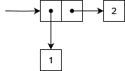
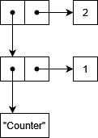

# Pairs
Data structures are very important. Once you start writing more complicated programs, you will
inevitably need a way to organize the data you process.

In RainLisp, the basis for all data structures is the pair. It's a data structure that rules them
all and comprises of just two values bundled together.

It's counter-intuitive how so many complex data structures can be built out of this simple one.
One can build lists, queues, stacks, binary trees and more based on pairs, as we will see later in the advanced section.

## Cons
In order to create a pair, we can use the [cons](../primitives/cons.md) primitive procedure and supply the first and second
constituent parts.

```scheme
(cons 1 2)
```
-> *(1 . 2)*

As you can see, the string representation of a pair is the first value, followed by a dot, followed by
the second value and having all surrounded with parentheses.

The above pair looks something like that in memory.



It consists of two values (boxes), each containing a pointer to another value; `1` and `2` respectively.

We can also mix pairs together.

```scheme
(cons (cons "Counter" 1) 2)
```
-> *(("Counter" . 1) . 2)*

We just specified a pair whose first value is another pair and the second one is the number `2`.
It is represented in memory as follows.



Once, you start mixing pairs in more complex ways, you might observe a string representation
that you may find confusing. You don't need to worry about it at all, it's just a string
representation of the value after all. Though, if you are curious, you will have to wait a little
bit, until we talk about lists and how they are represented.

```scheme
(cons (cons 1 2) (cons 3 4))
```
-> *((1 . 2) 3 . 4)*

> Note that pairs are reference types. So, if you compare two, you are comparing their memory addresses.

```scheme
(= (cons 1 2) (cons 1 2))
```
-> *false*

> It's worth mentioning the [pair?](../primitives/is-pair.md) primitive procedure, that you can use
to check if a given value is a pair or not.

> It's a common LISP convention that procedures that return a boolean value, are given
a name ending with a question mark. It's an indication that they question the validity of a fact.

## Car
To get the first element of a pair, you can use the [car](../primitives/car.md) primitive procedure.

```scheme
(car (cons 1 2))
```
-> *1*

## Cdr
To get the second element of a pair, you can use the [cdr](../primitives/cdr.md) primitive procedure.

```scheme
(cdr (cons 1 2))
```
-> *2*

> The procedure names `cons`, `car` and `cdr` that handle pairs, might seem peculiar, but they have
generally become standard in LISP for historical reasons. For what it's worth, the name `cons` stands
for "*Construct*", `car` for "*Contents of Address part of Register'*" and `cdr`, which is pronounced
could-er, stands for "*Contents of Decrement part of Register*".

## Pair Mutation
But once created, can we change a pair? The answer is yes; it's done with the `set-car!` and `set-cdr!`
primitive procedures.

Let's see a couple of examples.

```scheme
; Create a pair.
(define a-pair (cons 1 2))
a-pair

; Change the first element.
(set-car! a-pair 3)
a-pair

; Change the second element.
(set-cdr! a-pair 4)
a-pair
```
->
```
(1 . 2)
(3 . 2)
(3 . 4)
```

In the above example, you see how we started with pair `(1 . 2)` and ended up with `(3 . 4)`.

>Although simple in principle, these two primitive procedures can unlock the power that allows us
to build elaborate data structures, as we will see later in the advanced section.

## Car and cdr flavors
Traditionally in LISP, there are 28 car and cdr flavors that combine alternating `car` and `cdr` operations,
allowing you to dig into pairs up to four levels deep with a single procedure.

Once you get used to the logic behind their naming, you can use them for brevity, instead of explicitly
combining `car` and `cdr` operations yourself.

The logic behind their names is that you start with a `c` and end with an `r` (just like `car` and `cdr` do)
and in between there are `a`s that correspond to `car`s and `d`s that correspond to `cdr`s.
For example, `(cadr pair)` is equivalent to `(car (cdr pair))`.

```scheme
(define pair (cons (cons 1 2) (cons 3 4)))
(cadr pair)
```
-> *3*

The `cdr` above gives the second element, which is the pair `(3 . 4)`. Then `car` is applied to it and
gives `3`.

Let's see `(caddr pair)` which is equivalent to `(car (cdr (cdr pair)))`.

```scheme
(define pair 
  (cons 
    (cons (cons 1 2) (cons 3 4)) 
    (cons (cons 5 6) (cons 7 8))))

(caddr pair)
```
-> *7*

You can find all `car` and `cdr` flavors in the [specification](../common-libraries.md).

Next, we will see [lists](lists.md).