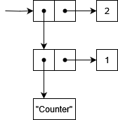

# Pairs
Data structures are very important. Once you start writing more complicated programs, you will
inevitably need a way to organize the data you process.

In RainLisp, the basis for all data structures is the pair. It's a data structure that rules them
all and comprises of just two values bundled together.

It's counter-intuitive how so many complex data structures can be built out of this simple one.
One can build lists, queues, stacks, binary trees and more based on pairs, as we will see later in the advanced section.

> The procedure names `cons`, `car` and `cdr` that handle pairs, might seem peculiar but they are the
standard names used in LISP in general. The name `cons` stands for "*Construct*", `car` for "*Contents of Address part of Register'*"
and `cdr` which is pronounced could-er, stands for "*Contents of Decrement part of Register*".
You don't need to worry about this at all, it is just mentioned for historic purposes.

## Cons
In order to create a pair, we can use the `cons` primitive procedure and supply the first and second
constituent parts.

```scheme
(cons 1 2)
```
-> *(1 . 2)*

As you can see, the string representation of a pair is the first value, followed by a dot, followed by
the second value and all surrounded with parentheses.

The above pair looks something like that in memory.


It consists of two values (boxes), each containing a pointer to its actual value; `1` and `2` respectively.

We can also mix pairs together.

```scheme
(cons (cons "Counter" 1) 2)
```
-> *(("Counter" . 1) . 2)*

We just specified a pair whose first value is another pair and the second one is the number `2`.

This pair is represented in memory as follows.



Once, you start mixing pairs in more complex ways, you might observe a string representation
that you may find confusing. You don't need to worry about it at all, it's just a string
representation of the value. Though, if you want to understand it, you will have to wait a little
bit until we talk about lists.

```scheme
(cons (cons 1 2) (cons 3 4))
```
-> *((1 . 2) 3 . 4)*

> Note that pairs are reference types. So, if you compare two, you are comparing their memory addresses.

```scheme
(= (cons 1 2) (cons 1 2))
```
-> *false*

## Car

## Cdr

## Car and cdr flavors
